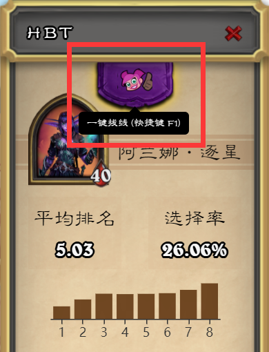
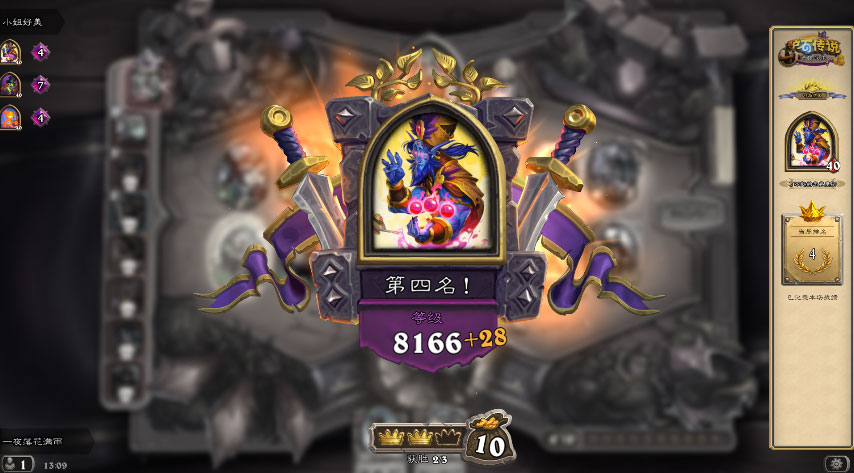
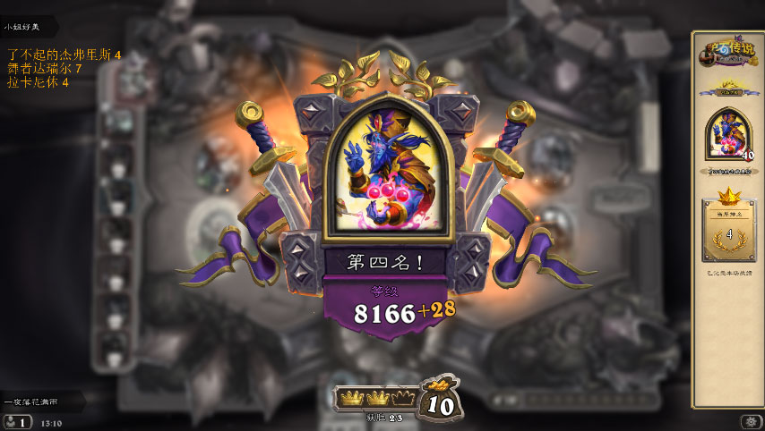

<h1 align="center">
  <a href="https://hs.chenyueban.com" target="_blank">HBT - 炉石传说酒馆战棋插件</a>
</h1>

  统计每天的战棋战绩，并通过数据分析得到你最拿手的英雄！

  
  

## 🚀 特性

- 🌴 当天战绩统计
- 📦 历史战绩查询
- 🎉 数据分析，统计你所使用过的英雄，自动计算每个英雄的平均排名、选择率
- 🙈 选择英雄时展示可选英雄的大数据选择率、平均排名等
- 🃏 对局信息记录，记录对局过的对手阵容
- ✈️ 一键拔线
- 🚄 连接 OBS 自动同步当天战绩到 OBS
- 😻 跨平台 同时支持 Windows MacOS

## 🍦 下载

前往 [release](https://github.com/hbt-org/hearthstone-battlegrounds-tools/releases) 选择属于你平台的安装包

## ⏳ 一键拔线

拔线需要使用管理员权限打开插件。

点击插件上方的拔线按钮或者按下快捷键 `F1`（推荐在倒计时 5-3 秒时拔线）

## 😎 OBS 连接

目前可实现当天统计的战绩同步到 OBS 中（支持展示文字或图片），效果如下图

连接到 OBS 教程：

1. 安装 OBS 插件 [obs-websocket](https://github.com/Palakis/obs-websocket/releases)
1. 打开 OBS 选择菜单栏 工具 - Websockets Server Settings (如果没有这个选项需要确认上面的插件是否安装，并且安装完后是否重启 OBS)
1. 设置服务器端口以及身份验证等 (可不修改直接确定，但是考虑到安全推荐设置密码)
1. 打开工具 - 选择下方设置按钮 - 找到 OBS 设置栏 - 点击 **连接 OBS** 按钮并输入验证信息 (若上一步没有修改信息这里直接点连接就好)
1. 连接成功后 会出现 **输出文字**/**输出图片** 以及相应的选择框，选择框选择你在 OBS 内设置好的文本来源 (例如 OBS 中设置了名为 test 的文本来源，选择框这里就选择 test)
1. 现在你每新增一条战绩，OBS 内便会同步一条战绩

> 注意：OBS 文本来源必须选择类型为 **文本（GDI+）** 若没有这个选项需要更新 [OBS](https://obsproject.com/)

## 贡献

[HBT 贡献指南](./CONTRIBUTING.md)

## CHANGELOG

[CHANGELOG](./CHANGELOG.md)

## 👍 交流

如果你有什么问题，或者有什么好的想法，请加群

## LICENSE

[MIT](./LICENSE)
